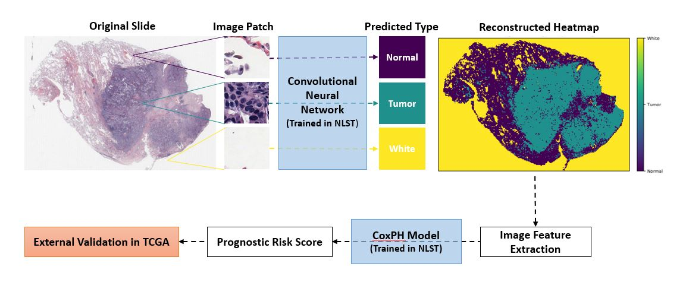

# Comprehensive analysis of lung cancer pathology images

Scripts for https://www.nature.com/articles/s41598-018-27707-4, _Comprehensive analysis of lung cancer pathology images to discover tumor shape and boundary features that predict survival outcome_.

## Citation 

Wang, S., Chen, A., Yang, L., Cai, L., Xie, Y., Fujimoto, J., ... & Xiao, G. (2018). Comprehensive analysis of lung cancer pathology images to discover tumor shape features that predict survival outcome. bioRxiv, 274332.

## This repository includes

## Requirements
